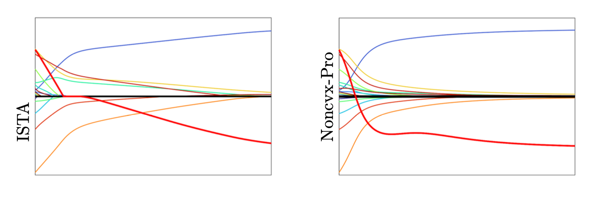

# Smooth Bilevel Programming for Sparse Regularization

This repository contains the code to reproduce the results of the article

> Clarice Poon and Gabriel Peyré, Smooth Bilevel Programming for Sparse Regularization, 2021.

